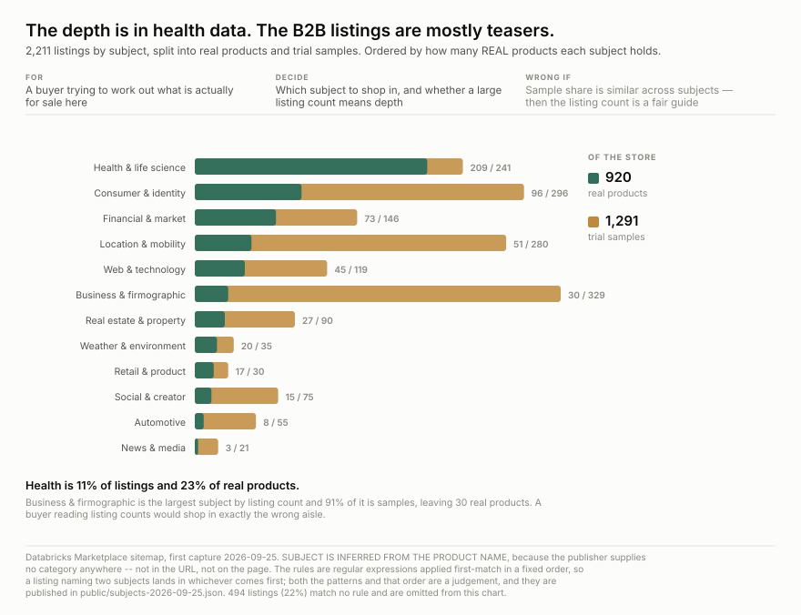
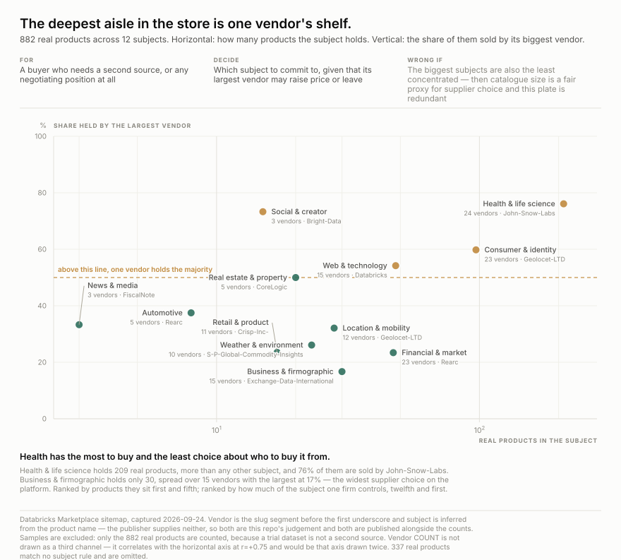
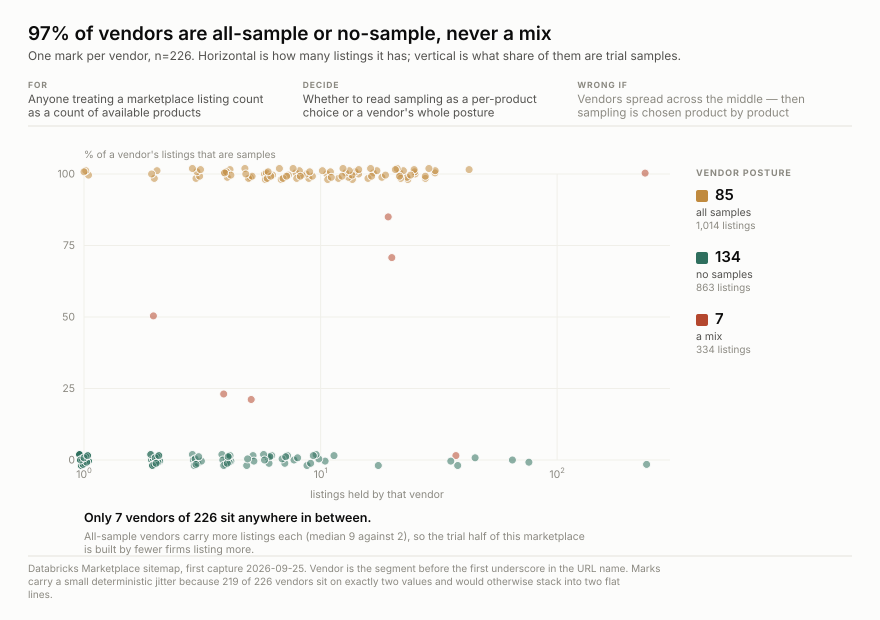

<h1 align="center">wss-databricks-marketplace</h1>

<p align="center">
  <strong>Which data products get withdrawn from the Databricks Marketplace</strong>
</p>

<div align="center">

  <a href="https://github.com/q3dresearch/wss-databricks-marketplace/actions/workflows/capture.yml"></a>
  <a href="https://github.com/q3dresearch/wss-databricks-marketplace/commits"></a>
  <a href="https://github.com/q3dresearch/wss-databricks-marketplace/blob/main/LICENSE"></a>

</div>

<p align="center">
  <sub>fleet: <a href="https://github.com/q3dresearch/wss-engine">engine</a> · <a href="https://github.com/q3dresearch/wss-snowflake-marketplace">snowflake marketplace</a> · <strong>databricks marketplace</strong> · <a href="https://github.com/q3dresearch/wss-shopify-apps">shopify apps</a> · <a href="https://github.com/q3dresearch/wss-apify">apify</a></sub>
</p>

**2,211 listings from 226 vendors**, weekly, from Databricks' own sitemap. A
listing withdrawn from sale simply leaves it — there is no status meaning
delisted, and no archive.


**Most of this marketplace is not products.** 1,329 of 2,211 listings are
samples — trial datasets Databricks marks with `SAMPLE` in the name. **Quote 882,
not 2,211.**

Databricks places that marker three ways and the trailing one is easy to miss:
`-SAMPLE-` infix, a `SAMPLE` prefix, and a trailing `-Sample`. Testing only the
first two — which this repo did until 2026-09-25 — misses 38 listings from
Vaisala, Precisely, Foursquare, AccuWeather, CoreLogic and Shutterstock, and
every one of them inflates the real-product base a buyer is quoted.

And the split is not uniform. The two largest vendors are opposites:
**Techsalerator's 246 listings are 98% samples; John-Snow-Labs' 241 are 0%.**
Together they are 22% of the store. It is not a big-vendor habit either — 57%
among vendors with 20+ listings against 60% among smaller ones, so the split runs
store-wide.

**Every source, its live URL, its licence and its last stored capture is listed
in [SOURCES.md](SOURCES.md)** — generated by `wss sources`.

## What is actually for sale

Vendor names tell a buyer nothing. The publisher supplies **no category anywhere** — not in
the URL, not on the page — so subject is inferred from the product name.



| subject | listings | samples | real products | vendors | largest vendor |
| --- | ---: | ---: | ---: | ---: | --- |
| Health & life science | 241 | 13% | **209** | 24 | John-Snow-Labs 76% |
| Consumer & identity | 308 | 68% | **97** | 23 | Geolocet-LTD 60% |
| Web & technology | 129 | 63% | **48** | 15 | Databricks 54% |
| Financial & market | 114 | 59% | **47** | 23 | Rearc 23% |
| Business & firmographic | 334 | 91% | **30** | 15 | Exchange-Data-International 17% |
| Location & mobility | 281 | 90% | **28** | 12 | Geolocet-LTD 32% |
| Weather & environment | 38 | 40% | **23** | 10 | S-P-Global-Commodity-Insights 26% |
| Real estate & property | 63 | 68% | **20** | 5 | CoreLogic 50% |
| Retail & product | 29 | 41% | **17** | 11 | Crisp-Inc- 24% |
| Social & creator | 75 | 80% | **15** | 3 | Bright-Data 73% |
| Automotive | 55 | 86% | **8** | 5 | Rearc 38% |
| News & media | 21 | 86% | **3** | 3 | FiscalNote 33% |

**The listing count points at the wrong aisle.** Business & firmographic is the largest
subject by listings and **91% of it is samples**, leaving 30 real products. Health & life
science is 11% of listings but **23% of all real products** — and 159 of its 241 come from
one vendor, John-Snow-Labs.

The taxonomy is regular expressions applied first-match in a fixed order. Both the patterns
and the order are a judgement, published in
[`public/subjects-2026-09-25.json`](public/subjects-2026-09-25.json). **523 listings (24%)
match no rule** and are left out of the chart rather than forced into a bucket.

## Who else can sell it to you

A listing count says how much is on the shelf. It does not say how many people
stock it, and those two rank almost oppositely here.



**Health & life science is the deepest subject and the most captive one.** It holds
209 real products, more than any other, and **76% of them are sold by
John-Snow-Labs**. If that one vendor raises its price or leaves, roughly
50 products remain across the other
23 vendors.

**Business & firmographic is the opposite.** Only 30 real products, but spread over
15 vendors with the largest at **17%** — the widest supplier choice
on the platform. Social & creator is the worst of both: 15 products from
3 vendors, 73% of them Bright-Data.

Four of twelve subjects are majority-held by a single vendor. Samples are excluded
throughout — a trial dataset is not a second source. The per-subject numbers are in
[`public/supplier-depth-2026-09-25.json`](public/supplier-depth-2026-09-25.json).

## Sampling is a vendor posture, not a product decision



**134 vendors are at exactly 0% samples and 85 at exactly 100%. Only 7 of 226 sit
anywhere in between.** A firm decides whether it is a sampling operation or a
selling one, and then every listing follows.

All-sample vendors carry more listings each — median 9 against 2 — so the trial
half of this marketplace is built by fewer firms listing more.

## Survival is not computable yet, and one memento is a trap

Three Internet Archive mementos of the sitemap exist. **One of them is not an
archive at all**: the capture dated 2024-09-17 is byte-for-byte identical to the
live set of 2026-09-25 — Wayback served the live page. Using it as a baseline
would have reported **zero churn over two years**.

The two real observations give retention over fixed intervals, not a curve:

| baseline | listings then | still listed today |
| --- | ---: | ---: |
| 2023-06-28 | 489 | **94.3%** |
| 2024-04-19 | 1,130 | **82.3%** |

Two points is not a survival curve and none is drawn from them. That is what the
weekly capture is for.

## Questions this exists to answer

| # | Question | Status |
| --- | --- | --- |
| Q1 | What is this marketplace actually made of? | **answered** — 60.1% samples, 882 real products, 226 vendors |
| Q2 | Which data products are withdrawn, and when? | needs 2+ captures. **The reason for capturing** |
| Q3 | Do samples convert to products, or just churn? | open — a sample becoming a product is a name change, so it will look like one death and one birth |
| Q4 | Do whole vendors exit? | open — vendor is free from the URL, so this is answerable from two captures |
| Q5 | How long does a listing survive? | needs ~1 year. Of 3 Internet Archive mementos **one is the live page served back**, leaving two real observations — retention of 94.3% from 2023-06 and 82.3% from 2024-04, which is not a curve |
| Q6 | Is there any usage or popularity signal? | **answered — no.** Nothing anywhere publishes one |
| Q7 | Can we see a sample's fields, row count or update frequency? | **answered — not anonymously.** `/api/2.0/marketplace-consumer/listings` returns **401, not 404**, so the endpoint exists and needs a Databricks identity. `Allow: /open-marketplace` in robots leads only to the same SPA shell |
| Q8 | If I need category X, how many vendors can actually sell it to me? | **answered** — see `public/supplier-depth`. Listing count and supplier depth rank almost oppositely: Health has 209 real products but 76.1% come from one vendor; Business & firmographic has 30 across 15 vendors, top one at 16.7% |

## The URL carries everything the page does not

A listing is `/details/<uuid>/<Vendor>_<Product-Name>`, and **all 2,211 have the
name segment**. So the sitemap alone gives a stable key, a product name and a
vendor — more than Snowflake's slug, far more than Salesforce's opaque id.

**This repo's own catalogue entry previously said the opposite.** It was recorded
as *"uuid only, no name in the URL — a departure is visible, the product is
not"*, with a next step calling for a one-off pass over 2,211 detail pages to
resolve names while listings were still live. That came from generalising a
single URL that happened to end in a trailing slash. None of it was needed.

**Split the vendor on the underscore, not the hyphen.** Product names are
hyphen-separated and vendor names contain hyphens themselves — `john-snow-labs`
becomes three useless tokens on `-`, and showed up as the second-largest
"vendor" in a first count.

## The detail page is worthless, unusually so

58,299 chars with `<title>Databricks Marketplace`, no `og:title`, no `h1`, no
meta description, no JSON-LD. Its only embedded JSON is **feature flags**. Not
one field about the product — not even its name.

So there is **no denominator**: no downloads, no subscribers, no rating, no date.
This is an arrivals-and-departures series and must never be described as a
popularity one.

## Using it

```bash
B=https://raw.githubusercontent.com/q3dresearch/wss-databricks-marketplace/main/derived/observations
duckdb -c "SELECT * FROM read_csv_auto('$B/2026-09.csv.gz') LIMIT 5"
```

`entity_id` is the listing uuid. Metrics: `listed` — whose **absence** later is
the withdrawal — plus `listing_name`, `vendor` and `is_sample`. One capture is
516 KB.

## Licence

**Not established.** robots permits the sitemap and listing paths; no licence
statement was found and Databricks' terms have not been read for a redistribution
grant. What is captured is a list of public URLs, not vendor content — the pages
contain none. See [LICENSE-DATA](LICENSE-DATA).
