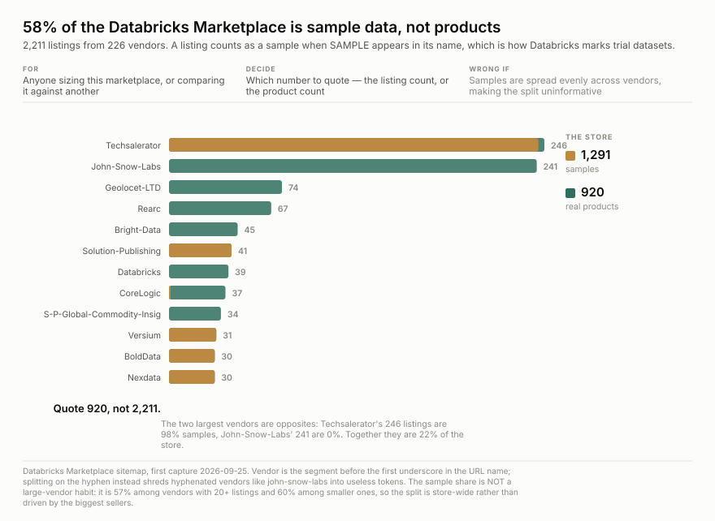

<h1 align="center">wss-databricks-marketplace</h1>

<p align="center">
  <strong>Which data products get withdrawn from the Databricks Marketplace</strong>
</p>

<div align="center">

  <a href="https://github.com/q3dresearch/wss-databricks-marketplace/actions/workflows/capture.yml"></a>
  <a href="https://github.com/q3dresearch/wss-databricks-marketplace/commits"></a>
  <a href="https://github.com/q3dresearch/wss-databricks-marketplace/blob/main/LICENSE"></a>

</div>

<p align="center">
  <sub>fleet: <a href="https://github.com/q3dresearch/wss-engine">engine</a> · <a href="https://github.com/q3dresearch/wss-snowflake-marketplace">snowflake marketplace</a> · <strong>databricks marketplace</strong> · <a href="https://github.com/q3dresearch/wss-shopify-apps">shopify apps</a> · <a href="https://github.com/q3dresearch/wss-apify">apify</a></sub>
</p>

**2,211 listings from 226 vendors**, weekly, from Databricks' own sitemap. A
listing withdrawn from sale simply leaves it — there is no status meaning
delisted, and no archive.



**Most of this marketplace is not products.** 1,291 of 2,211 listings are
samples — trial datasets Databricks marks with `SAMPLE` in the name. **Quote 920,
not 2,211.**

And the split is not uniform. The two largest vendors are opposites:
**Techsalerator's 246 listings are 98% samples; John-Snow-Labs' 241 are 0%.**
Together they are 22% of the store. It is not a big-vendor habit either — 57%
among vendors with 20+ listings against 60% among smaller ones, so the split runs
store-wide.

**Every source, its live URL, its licence and its last stored capture is listed
in [SOURCES.md](SOURCES.md)** — generated by `wss sources`.

## Questions this exists to answer

| # | Question | Status |
| --- | --- | --- |
| Q1 | What is this marketplace actually made of? | **answered** — 58.4% samples, 920 real products, 226 vendors |
| Q2 | Which data products are withdrawn, and when? | needs 2+ captures. **The reason for capturing** |
| Q3 | Do samples convert to products, or just churn? | open — a sample becoming a product is a name change, so it will look like one death and one birth |
| Q4 | Do whole vendors exit? | open — vendor is free from the URL, so this is answerable from two captures |
| Q5 | How long does a listing survive? | needs ~1 year. Only 3 Internet Archive mementos exist, so there is no backfill to shortcut it |
| Q6 | Is there any usage or popularity signal? | **answered — no.** Nothing anywhere publishes one |

## The URL carries everything the page does not

A listing is `/details/<uuid>/<Vendor>_<Product-Name>`, and **all 2,211 have the
name segment**. So the sitemap alone gives a stable key, a product name and a
vendor — more than Snowflake's slug, far more than Salesforce's opaque id.

**This repo's own catalogue entry previously said the opposite.** It was recorded
as *"uuid only, no name in the URL — a departure is visible, the product is
not"*, with a next step calling for a one-off pass over 2,211 detail pages to
resolve names while listings were still live. That came from generalising a
single URL that happened to end in a trailing slash. None of it was needed.

**Split the vendor on the underscore, not the hyphen.** Product names are
hyphen-separated and vendor names contain hyphens themselves — `john-snow-labs`
becomes three useless tokens on `-`, and showed up as the second-largest
"vendor" in a first count.

## The detail page is worthless, unusually so

58,299 chars with `<title>Databricks Marketplace`, no `og:title`, no `h1`, no
meta description, no JSON-LD. Its only embedded JSON is **feature flags**. Not
one field about the product — not even its name.

So there is **no denominator**: no downloads, no subscribers, no rating, no date.
This is an arrivals-and-departures series and must never be described as a
popularity one.

## Using it

```bash
B=https://raw.githubusercontent.com/q3dresearch/wss-databricks-marketplace/main/derived/observations
duckdb -c "SELECT * FROM read_csv_auto('$B/2026-09.csv.gz') LIMIT 5"
```

`entity_id` is the listing uuid. Metrics: `listed` — whose **absence** later is
the withdrawal — plus `listing_name`, `vendor` and `is_sample`. One capture is
516 KB.

## Licence

**Not established.** robots permits the sitemap and listing paths; no licence
statement was found and Databricks' terms have not been read for a redistribution
grant. What is captured is a list of public URLs, not vendor content — the pages
contain none. See [LICENSE-DATA](LICENSE-DATA).
